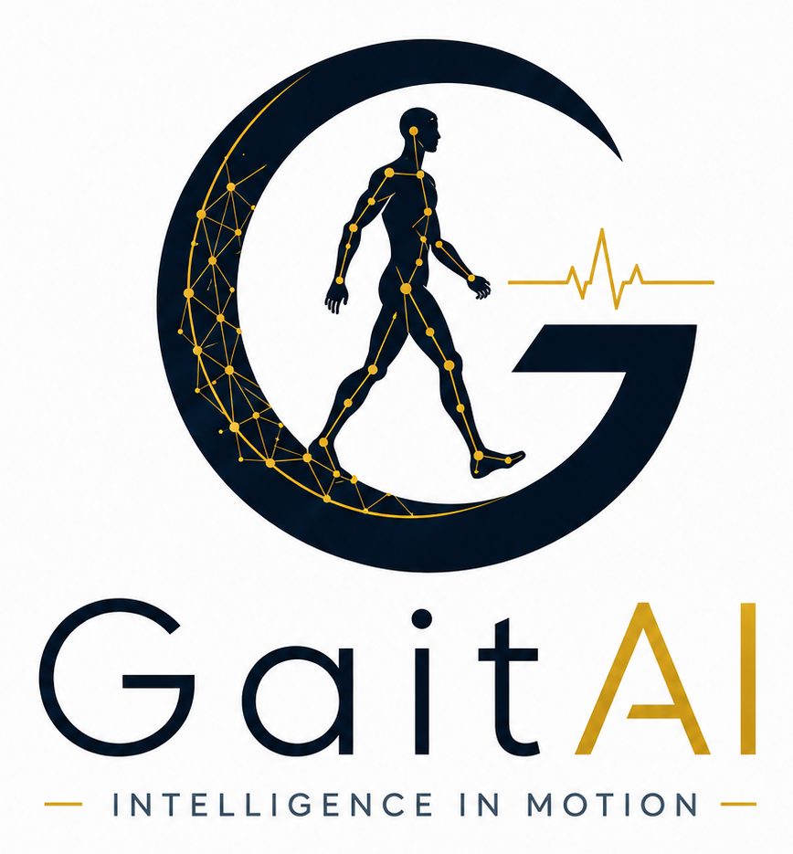

<div align="center">



# GaitAI — Human Movement Intelligence Platform

**An AI-powered platform that transforms walking videos, wearable signals, posture and crowd movement into actionable healthcare, rehabilitation, sports, mobility, safety and security insights.**

[](https://nextjs.org)
[](https://www.typescriptlang.org)
[](https://tailwindcss.com)
[](https://www.framer.com/motion/)
[](https://threejs.org)
[](#license)

</div>

---

## Table of contents

1. [Overview](#overview)
2. [The platform at a glance](#the-platform-at-a-glance)
3. [Tech stack](#tech-stack)
4. [Frontend architecture](#frontend-architecture)
5. [Project structure](#project-structure)
6. [Routing & sitemap](#routing--sitemap)
7. [Design system](#design-system)
8. [Theming — dark & light](#theming--dark--light)
9. [Navigation & page transitions](#navigation--page-transitions)
10. [Animation language](#animation-language)
11. [Code-rendered visuals](#code-rendered-visuals)
12. [Brand assets & favicons](#brand-assets--favicons)
13. [Founder](#founder)
14. [Content modules — Publications & Admin](#content-modules--publications--admin)
15. [API reference](#api-reference)
16. [Getting started](#getting-started)
17. [Environment variables](#environment-variables)
18. [Scripts](#scripts)
19. [Accessibility & performance](#accessibility--performance)
20. [Deployment](#deployment)
21. [Roadmap & future scope](#roadmap--future-scope)
22. [License](#license)

---

## Overview

GaitAI is a production-grade, research-led marketing and publication platform for the **GaitAI** brand — a Human Movement Intelligence Platform built on **10+ years of founder-led research** in gait recognition, computer vision, biometrics and movement AI.

The platform organises everything around two verticals and 23 modular products:

| Vertical | Focus |
| --- | --- |
| **GaitAI MobilityCare** | Camera-based gait assessment, rehab tracking, fall-risk screening, sports motion analytics, neurological & orthopedic gait monitoring, smartwatch-based mobility intelligence. |
| **GaitAI SecureVision** | Movement anomaly detection, crowd flow analytics, worker safety, post-event investigation, gait re-identification, campus & event safety, privacy-aware surveillance. |

The site is engineered to feel comparable to top-tier deep-tech, healthcare and enterprise SaaS brands: a cinematic WebGL hero, layered storytelling, glassmorphism, gradient meshes, micro-interactions, a fully theme-aware brand mark, a route-level slide transition that turns navigation itself into part of the brand experience, and code-rendered product mockups in place of marketing screenshots.

---

## The platform at a glance

- **23 products** across two verticals (12 MobilityCare + 11 SecureVision).
- **17 industry use cases** mapped to product mixes and concrete outcomes.
- **A 10-module AI pipeline** (pose, gait features, sensor fusion, fall-risk model, rehab model, sports-injury model, WatchCare sensor model, anomaly detection, clinical report generator, privacy layer).
- **A complete site map** — Home, About, MobilityCare, SecureVision, Products, Use Cases, Research, Publications, Admin, plus legal stubs.
- **A founder-credibility story** anchored in 2014 Parkinson's research, 2016 surveillance & biometrics expansion, a research portfolio (50+ publications, 6 patents, ~600 citations, 10+ keynotes), and a Ph.D. in CSE (AI).
- **Premium nav** with active-route highlighting and a gradient brand-color hover underline.
- **Cinematic page transitions** — outgoing page glides right while the incoming page slides in from the left, with a brand-gradient sweep.

---

## Tech stack

| Layer | Technology |
| --- | --- |
| Framework | **Next.js 14** (App Router, RSC, Edge-ready) |
| Language | **TypeScript 5.6** (strict) |
| Styling | **Tailwind CSS 3.4** + custom design tokens + safelist for dynamic accent classes |
| Motion | **Framer Motion 11**, **GSAP 3.12** (available for further scroll choreography) |
| 3D | **Three.js r169** via **@react-three/fiber** + **@react-three/drei** |
| Icons | **lucide-react** |
| Theming | **next-themes** (dark default, light supported) |
| Fonts | **Space Grotesk** (display), **Inter** (body), **JetBrains Mono** (mono) |
| Utilities | **clsx**, **tailwind-merge** |
| Tooling | ESLint, PostCSS, Autoprefixer |

> **Runtime:** Node 18.18+ (Node 22 LTS recommended).

---

## Frontend architecture

### Rendering model

The site uses Next.js **App Router** with a Server-Components-first model:

- **Server Components** for everything that doesn't need interactivity — every landing-page section's heading, the entire Hero, all four new vertical pages (`/about`, `/products`, `/use-cases`, `/research`), post lists, post detail pages, layout shell, metadata.
- **Client Components** (`"use client"`) are surgically scoped to interactive units: `Navbar`, `ThemeToggle`, `Logo` (theme-aware), `PageTransition`, `PostsList` (filter/search), `HeroScene` (WebGL), `ProductGrid` (filter state lives here), `Reveal` (scroll-driven motion wrapper), `JourneyTimeline`, the admin dashboard, and the contact form.

### RSC boundary discipline

A common pitfall — passing functions (Lucide icons, predicate callbacks) across the server-to-client boundary — was hit and resolved early. The cure:

- `ProductGrid` is a client component that accepts a `vertical: "mobilitycare" | "securevision" | "all"` string and looks up its own products plus filter definitions internally. The vertical pages just pass a string; no functions cross the boundary.
- `Reveal` is a tiny `motion.div` wrapper a Server Component can compose around static cards to opt them into a `whileInView` fade-up without converting the whole page to client.

### Composition

```
RootLayout (server)
  └─ Providers (client) ─ next-themes ThemeProvider
       └─ Navbar (client)              ← sticky, glassmorphic, gradient hover underline
       └─ <main>
            └─ PageTransition (client)
                  └─ {route children}  ← landing, vertical pages, products, use cases…
       └─ Footer (server)
```

`PageTransition` is keyed off `usePathname()` — every navigation through `<Link>` triggers the cinematic slide, while Navbar and Footer stay rock-solid.

### State strategy

- **No global store.** The site is stateless at the page level — content is sourced from server components, `src/data/products.ts`, `src/data/content.ts`, or `data/posts.json` via `src/lib/posts.ts`.
- **Local state only** for ephemeral UI (open/closed nav, mobile drawer, hover states, form fields, product-grid filter selection). Kept in `useState` co-located with each component.
- **Theme** is the only truly global concern — handled via `next-themes` and reflected in CSS variables in `globals.css`.

### Data layer

- **`src/data/products.ts`** is the canonical source of truth for the product universe — all 23 products with full metadata (name, short, label, headline, description, primary users, outputs, vertical, accent), the cross-vertical industry use cases, the AI pipeline architecture, the WatchCare feature grid, the workflow stages, and the research credibility pillars.
- **`src/data/content.ts`** holds the navigation labels and hero stats.
- **`data/posts.json`** persists publications through `src/lib/posts.ts` — intentionally a thin abstraction so the backend can swap to Supabase, Sanity, Postgres, Notion or Firestore.
- Uploads land in **`public/uploads/`** during local dev.

---

## Project structure

```
GaitAI_Fr_Version1_Claude/
├── data/
│   └── posts.json                       # dev-mode post storage
├── public/
│   ├── brand/                           # themed logo + founder portrait
│   │   ├── logo-horizontal-dark.png
│   │   ├── logo-horizontal-transparent.png
│   │   ├── icon-mark.png
│   │   ├── icon-mark-dark.png
│   │   ├── logo-dark.png / logo-light.png / logo-main.png
│   │   └── founder-anubha-parashar.png  # founder portrait
│   ├── favicons/                        # 16 → 512 + apple-touch-icon
│   ├── uploads/                         # post attachments (dev)
│   ├── favicon.ico
│   └── manifest.webmanifest             # PWA manifest
├── src/
│   ├── Assets/                          # original raster sources (reference)
│   ├── app/
│   │   ├── layout.tsx                   # root layout, metadata, fonts, providers
│   │   ├── page.tsx                     # landing page composition
│   │   ├── providers.tsx                # next-themes wrapper
│   │   ├── globals.css                  # design tokens + custom utilities
│   │   ├── about/page.tsx               # mission, founder, journey, portfolio, audiences, values…
│   │   ├── mobilitycare/page.tsx        # vertical page: 12 products + flagships
│   │   ├── securevision/page.tsx        # vertical page: 11 products + flagships
│   │   ├── products/page.tsx            # all 23 products with cross-vertical filters
│   │   ├── use-cases/page.tsx           # all 17 industries
│   │   ├── research/page.tsx            # 10+ yrs research + pipeline + responsible AI
│   │   ├── publications/                # public newsroom + slug detail
│   │   ├── admin/page.tsx               # password-gated dashboard
│   │   ├── legal/                       # privacy, terms, security, responsible-ai stubs
│   │   └── api/                         # REST routes (posts, upload, auth)
│   ├── components/
│   │   ├── layout/
│   │   │   ├── Navbar.tsx               # flat-tab nav + gradient hover underline + drawer
│   │   │   ├── Footer.tsx               # 4-column footer w/ real routes
│   │   │   ├── ThemeToggle.tsx          # animated sun/moon switcher
│   │   │   └── PageTransition.tsx       # framer-motion slide route transitions
│   │   ├── sections/                    # landing-page sections
│   │   │   ├── Hero.tsx
│   │   │   ├── PartnerMarquee.tsx
│   │   │   ├── Verticals.tsx            # MobilityCare + SecureVision dual showcase
│   │   │   ├── FeaturedProducts.tsx     # 8-product strip
│   │   │   ├── WatchCareFlagship.tsx    # signature wearable section
│   │   │   ├── HowItWorks.tsx           # 4-stage workflow rail
│   │   │   ├── UseCases.tsx             # interactive bento (12 tiles)
│   │   │   ├── TechStack.tsx            # AI pipeline diagram
│   │   │   ├── ResearchCredibility.tsx  # decade-of-research ribbon + pillars
│   │   │   ├── JourneyTimeline.tsx      # 2014 → today timeline rail
│   │   │   ├── Vision.tsx               # philosophy quote + Predict/Prevent/Protect
│   │   │   └── CTA.tsx                  # demo-request form
│   │   ├── visuals/                     # code-rendered product mockups
│   │   │   ├── MobilityDashboardVisual.tsx
│   │   │   ├── SecureOperationsVisual.tsx
│   │   │   ├── SmartwatchVisual.tsx
│   │   │   ├── ClinicalReportVisual.tsx
│   │   │   ├── RunningTrailVisual.tsx
│   │   │   ├── SkeletonOverlayVisual.tsx
│   │   │   ├── CrowdHeatmapVisual.tsx
│   │   │   └── AIPipelineDiagram.tsx
│   │   ├── products/
│   │   │   ├── ProductCard.tsx          # accent-driven card w/ outputs pills
│   │   │   └── ProductGrid.tsx          # client-side filter pills + animated grid
│   │   ├── posts/                       # PostsList, PostCard, CategoryBadge
│   │   ├── admin/                       # AdminLogin, AdminDashboard, PostEditor
│   │   ├── three/HeroScene.tsx          # R3F WebGL hero
│   │   └── ui/
│   │       ├── Logo.tsx                 # theme-aware brand mark
│   │       ├── SectionHeading.tsx       # eyebrow + display title + description
│   │       ├── VerticalVisual.tsx       # legacy radar + waveform helpers
│   │       └── Reveal.tsx               # scroll-reveal wrapper
│   ├── data/
│   │   ├── products.ts                  # 23 products + 17 use cases + pipeline + pillars
│   │   └── content.ts                   # nav links + hero stats
│   └── lib/
│       ├── utils.ts                     # cn() — clsx + tailwind-merge
│       ├── posts.ts / posts-store.ts    # post facade + JSON persistence
│       ├── auth.ts                      # cookie auth helpers
│       └── markdown.tsx                 # tiny in-house markdown renderer
├── tailwind.config.ts                   # tokens + safelist for dynamic accent classes
├── next.config.mjs
├── tsconfig.json
└── package.json
```

---

## Routing & sitemap

```
/                        Home — hero, verticals, featured products, WatchCare flagship,
                              how it works, use cases, technology, research credibility,
                              vision, CTA.
/about                   Mission, founder story, our journey, research portfolio,
                              who we serve, values, partnerships, investors, CTA.
/mobilitycare            Hero, 12-product grid, flagship blocks (WalkScan, WatchCare,
                              SportsMotion, FallRisk), clinical use cases, CTA.
/securevision            Hero, governance ribbon, 11-product grid, PrivacyGuard deep block,
                              SuspiciousMotion/CrowdSense/IndustrialSafety trio,
                              deployment environments, CTA.
/products                All 23 products in one place, cross-vertical category filters
                              (Healthcare, Sports, Elderly Care, Wearables, Security,
                              Crowd, Industrial, Research, Privacy).
/use-cases               All 17 industries split by vertical, deep-linked anchors.
/research                Decade-of-research hero, JourneyTimeline, 4-stat ribbon,
                              6 research domains, AI pipeline diagram,
                              methods/datasets/validation, publication topics,
                              founder credit, Responsible AI commitment, CTA.
/publications            Newsroom — featured strip, filters, search, detail pages.
/publications/[slug]     Post detail with custom markdown renderer.
/admin                   Password-gated dashboard for posts CRUD.
/legal/privacy           Privacy policy placeholder.
/legal/terms             Terms of use placeholder.
/legal/security          Security overview placeholder.
/legal/responsible-ai    Responsible AI commitment placeholder.
/api/posts               REST: list / create.
/api/posts/[id]          REST: read / update / delete.
/api/upload              REST: attachment upload.
/api/auth                REST: login (cookie) / logout.
```

---

## Design system

A compact, opinionated palette around a single thesis: **deep obsidian + electric brand + neon glow**, extended with **vertical-specific accents**:

| Token | Hex | Role |
| --- | --- | --- |
| Obsidian | `#070B14` | Page background (dark) |
| Gunmetal | `#111827` | Card / surface |
| Royal Electric | `#2563FF` | Primary brand, SecureVision accent, CTA gradient start |
| Neon Violet | `#7C3AED` | Research accent, gradient mid |
| Ice Cyan | `#4FD1FF` | Glow accent, gradient end |
| Clinical Teal | `#0FA3B1` | **MobilityCare accent** (clinical / sports) |
| Warm Gold | `#D5A021` | **WatchCare accent** (wearable / preventive) |
| Emerald | Tailwind `emerald-300/400` | Privacy / safety success state |
| Soft White / Gray / Mute | tokens | Body & muted text |

All color tokens are declared as **RGB triplets** in `globals.css` (`--c-obsidian: 7 11 20;`) so every Tailwind utility composes with `/<alpha>` opacity modifiers (e.g. `bg-obsidian/80`).

### Tailwind safelist

Dynamic accent classes (driven by product `accent` strings via object lookup) are safelisted in `tailwind.config.ts` so the JIT scanner can't miss them in production builds. Every `text-{accent}-300`, `border-{accent}-300/30`, `bg-{accent}-300/8`, `hover:border-{accent}-300/40`, etc. for `teal · cyan · violet · amber · emerald · rose` is guaranteed to ship.

### Custom utilities (in `globals.css`)

`btn-primary`, `btn-ghost`, `card`, `card-glow`, `glass`, `pill`, `text-gradient`, `text-gradient-secure`, `text-gradient-care`, `ring-grid`, `noise`, `mask-fade-r`, `section`, `eyebrow`, `stat-num`, plus a library of background images (`gradient-brand`, `gradient-secure`, `gradient-care`, `gradient-mesh`, `radial-glow`, `grid-pattern`) and keyframes (`fade-up`, `pulse-glow`, `marquee`, `scan-line`, `float`, `shimmer`, `spin-slow`).

### Typography scale

| Class | Clamp | Use |
| --- | --- | --- |
| `text-display-2xl` | `3rem → 6.25rem` | Hero headlines |
| `text-display-xl` | `2.5rem → 4.5rem` | Section heroes |
| `text-display-lg` | `2rem → 3.25rem` | Section headings |
| `text-display-md` | `1.5rem → 2.25rem` | Sub-headings |

---

## Theming — dark & light

The platform ships **dark by default** with a fully designed light mode.

- `next-themes` toggles `<html class="light">`; the absence of `.light` means dark.
- Every design token has a `:root.light` override in `globals.css` — colors, surfaces, glass tints, shadows, divider gradients, grid lines, and noise opacity all retune for the light palette.
- `ThemeToggle` is a hydration-safe client component with an animated sun/moon morph.
- `viewport.themeColor` is media-query-aware, so the iOS/Android status bar tints to `#F6F8FC` in light and `#070B14` in dark automatically.

### Theme-aware brand mark

`<Logo />` (in `src/components/ui/Logo.tsx`) is the canonical brand wrapper. It swaps PNG art between dark and light variants via `useTheme().resolvedTheme` with a mounted guard to prevent hydration flash. Three variants:

| Variant | Use |
| --- | --- |
| `wordmark` | Navbar / footer — horizontal lockup |
| `icon` | Compact placements — just the G + walker mark |
| `stacked` | Hero / press kits — full vertical lockup w/ tagline |

Each variant has `sm`, `md`, `lg` sizes with locked aspect ratios so layout never reflows.

---

## Navigation & page transitions

### Navbar

Flat-tab desktop navigation with six tabs — **About · MobilityCare · SecureVision · Products · Use Cases · Publications** — plus the GaitAI logo on the left and a ThemeToggle + *Request demo* CTA on the right.

Two notable details:

- **Active-route detection** via `usePathname()` lights the matching tab.
- **Gradient hover underline** — a `cyan → royal → violet` underline scales in from the center on hover and stays lit on the active route. Pure CSS transforms, GPU-friendly, the same `cubic-bezier(0.16, 1, 0.3, 1)` ease used elsewhere on the site.

Mobile uses an animated drawer with the same six tabs as a staggered display-typography list.

### PageTransition

`PageTransition` wraps `{children}` inside `<main>`. It is the heart of the navigation experience:

- Keyed off `usePathname()` so every route change fires it.
- Uses `AnimatePresence mode="popLayout"` so the outgoing route slides **right while the incoming route enters from the left simultaneously**.
- Animates `transform` + `opacity` + `filter` only — GPU-composited, no layout thrash.
- Eased with `cubic-bezier(0.83, 0, 0.17, 1)` (expo-in-out) over **850 ms**.
- A delicate **brand-gradient sweep** plus a **hair-thin glowing leading edge** streak across the viewport in lockstep.
- **`prefers-reduced-motion`** honored — affected users get a 250 ms cross-fade instead.

Navbar and Footer sit **outside** the transition wrapper, so they stay rock-solid while the page content slides between them.

---

## Animation language

Every motion choice on the site comes from the same vocabulary:

- **Easing** — `cubic-bezier(0.16, 1, 0.3, 1)` for content reveals, `cubic-bezier(0.83, 0, 0.17, 1)` (expo-in-out) for page transitions.
- **`Reveal` wrapper** — a small client component that animates its children in with a fade-up (`y: 28 → 0`, `opacity: 0 → 1`) when they enter the viewport via `whileInView`. Server-Component pages can opt sub-trees into scroll-driven motion without going client.
- **Section reveals** — every major section uses Framer Motion `useInView` for fade-up + stagger of children.
- **HowItWorks rail** — `useScroll` + `useTransform` drives a vertical gradient line that draws itself as the user scrolls.
- **Marquee + scan lines** — the partner marquee uses an infinite `marquee` keyframe; the hero scroll indicator uses `scan-line`.
- **WebGL Hero** — `HeroScene.tsx` is `dynamic({ ssr: false })` so the 3D bundle never blocks first paint.
- **Reduced motion** — respected by `PageTransition` and `Reveal`.

---

## Code-rendered visuals

Instead of marketing screenshots, every product moment on the site is rendered as code (SVG + Canvas + Framer Motion), so visuals stay crisp at any zoom, are fully theme-aware, and animate live:

| Visual | Used in |
| --- | --- |
| `MobilityDashboardVisual` | Verticals card — clinical mobility console (walking figure + score ring + waveform + metric chips) |
| `SecureOperationsVisual` | Verticals card — privacy-aware ops console (floor plan + animated people dots + camera thumbs + event timeline) |
| `SmartwatchVisual` | WatchCareFlagship + MobilityCare page — premium smartwatch UI with animated score ring + trend chart |
| `ClinicalReportVisual` | MobilityCare page — sample report card with mobility score, fall-risk pill, 4-up metric strip, recovery sparkline |
| `RunningTrailVisual` | MobilityCare page — SportsMotion running stride trails + asymmetry indicator |
| `SkeletonOverlayVisual` | MobilityCare page hero — pose-estimation skeleton + HUD overlays |
| `CrowdHeatmapVisual` | SecureVision page hero — crowd density heatmap + flow arrows |
| `AIPipelineDiagram` | TechStack + Research page — inputs → 10-module AI engine → outputs |
| `JourneyTimeline` | About + Research pages — 2014 → 2016 → research portfolio → today rail |

---

## Brand assets & favicons

Brand artwork lives in `public/brand/` and was generated from the originals in `src/Assets/`:

- **Themed logos** — cream-on-transparent (dark theme) and navy-on-transparent (light theme) variants for both horizontal wordmark and square icon mark.
- **Full lockups** — themed PNGs with tagline, used in the footer and OG/Twitter share cards.
- **Founder portrait** — `founder-anubha-parashar.png`, served with `next/image` (priority load on `/about#founder`, lazy on `/research`).

Favicons in `public/favicons/` cover **16, 32, 64, 128, 256, 512** plus `.ico` and `apple-touch-icon.png`. `manifest.webmanifest` declares the app for PWA installs.

All assets are wired through Next.js `metadata.icons` in `src/app/layout.tsx`.

---

## Founder

**Dr. Anubha Parashar** — AI Research Scientist · Founder & CEO, GaitAI.

Ph.D. in Computer Science & Engineering (AI specialization) from **Manipal University Jaipur**. Doctoral research on gait recognition under occlusion, clothing variation and viewpoint changes. 10+ years across research, academia and industry — eight of those as a Senior Assistant Professor in Computer Science & Engineering, mentoring postgraduate researchers and designing AI curricula, before transitioning into industry-focused AI innovation across computer vision, OCR, large language models, forecasting, optimization, edge AI and intelligent automation.

**Research output:** 50+ peer-reviewed publications · 6 published or granted patents · ~600 academic citations · 10+ keynote talks and invited sessions.

**Areas of expertise:** Artificial Intelligence & ML, Deep Learning & Neural Networks, Computer Vision, Generative AI & LLMs, Biometrics & Gait Recognition, Edge AI & IoT, Robotics & HMI, Data Science & Analytics, OCR & Document Intelligence.

The full founder profile and tagline lives on `/about#founder`. The Research page (`/research`) surfaces a smaller founder credit linked back to it. The portfolio is at [anubhaparashar.github.io](https://anubhaparashar.github.io/).

---

## Content modules — Publications & Admin

### `/publications` — public newsroom

A premium publication index supporting:

- Featured post strip + category-tinted post cards.
- Six categories: **Research · Announcements · Documentation · Approvals · Blog · Demos**.
- Live filters + full-text search (client-side).
- `/publications/[slug]` detail page with a custom in-house markdown renderer (`src/lib/markdown.tsx`) supporting headings, bold/italic, inline code, fenced code blocks, bullets, numbered lists, blockquotes, horizontal rules, and `[text](url)` links.
- Attachment download button (PDFs, etc.) and external-link cards.
- Related-posts strip + sticky sidebar with author, date and CTA.

### `/admin` — password-protected dashboard

Mobile-friendly content management:

- Password gate (`ADMIN_PASSWORD`, defaults to `gaitai-admin`).
- Cookie-based auth (`httpOnly`, `sameSite=strict`).
- Post list with search, edit and delete.
- Full editor — title, category, summary, markdown body, tags, attachment upload (up to 25 MB), external URL, author, publish date, featured toggle.
- Delete confirmation modal.
- Phone-publish ready.

### Storage (swappable)

Posts persist to `data/posts.json` and uploads to `public/uploads/`. This is intentional for local dev and self-hosted Node. Production deploys (Vercel, etc.) should swap `src/lib/posts-store.ts` for a hosted DB — UI, auth and routes will keep working without changes.

---

## API reference

| Method | Route | Auth | Description |
| --- | --- | :---: | --- |
| `GET` | `/api/posts` | — | List all posts |
| `POST` | `/api/posts` | yes | Create post |
| `GET` | `/api/posts/[id]` | — | Read one |
| `PUT` | `/api/posts/[id]` | yes | Update |
| `DELETE` | `/api/posts/[id]` | yes | Delete |
| `POST` | `/api/upload` | yes | Upload attachment |
| `POST` | `/api/auth` | — | Login (sets cookie) |
| `DELETE` | `/api/auth` | — | Logout |

---

## Getting started

```bash
# 1. Install
npm install

# 2. Configure environment
cp .env.example .env.local
# then edit ADMIN_PASSWORD inside .env.local

# 3. Run
npm run dev          # http://localhost:3000
npm run build        # production build
npm run start        # serve production build
npm run lint         # ESLint pass
```

Requires Node 18.18+ (Node 22 LTS recommended).

---

## Environment variables

| Variable | Default | Purpose |
| --- | --- | --- |
| `ADMIN_PASSWORD` | `gaitai-admin` | Required to sign in to `/admin` |

Copy `.env.example` to `.env.local` and override before deploying.

---

## Scripts

| Script | Purpose |
| --- | --- |
| `npm run dev` | Start Next.js dev server with HMR |
| `npm run build` | Production build |
| `npm run start` | Serve the production build |
| `npm run lint` | ESLint (Next.js config) |

---

## Accessibility & performance

- Semantic landmarks throughout (`header`, `main`, `nav`, `footer`, `section`, `article`).
- `prefers-reduced-motion` respected by `PageTransition`, `Reveal`, and decorative animations.
- WebGL Hero scene is `dynamic({ ssr: false })` so first paint is never blocked by the 3D bundle.
- `next/image` used for the founder portrait + logo with `priority` on above-the-fold, `sizes` configured to prevent oversizing.
- Fonts loaded via `next/font` with `display: swap`.
- Images via `next/image` with AVIF/WebP formats configured in `next.config.mjs`.
- Anchor links land below the fixed nav via `scroll-padding-top`.
- All animations use transform/opacity/filter — GPU-composited, layout-stable.
- TypeScript strict + `tsc --noEmit` passes with zero errors.

---

## Deployment

Recommended host: **Vercel** (one-click for Next.js App Router).

Before going to production:

1. Set `ADMIN_PASSWORD` to a strong, unique value in the host's env settings.
2. **Swap the posts storage** in `src/lib/posts-store.ts` from JSON-file to a hosted DB (Vercel's filesystem is read-only at runtime). Recommended: **Supabase** or **Postgres** for relational, **Sanity** for headless CMS, **Firestore** for low-ops NoSQL.
3. Verify Open Graph and Twitter card preview with the production URL.
4. Confirm favicons and the `manifest.webmanifest` are reachable.
5. Replace the legal placeholders in `/legal/*` with real, jurisdiction-specific policies before launch.

---

## Roadmap & future scope

What's done in the current build, and what remains.

### ✅ Phase 1 — Shipped

- [x] Homepage transformation around the Human Movement Intelligence Platform positioning
- [x] Two-vertical showcase (MobilityCare + SecureVision) with rebuilt premium dashboard mockups
- [x] WatchCare flagship section with code-rendered smartwatch + floating widgets
- [x] Featured Products strip (WalkScan, FallRisk, RehabTrack, SportsMotion, WatchCare, SuspiciousMotion, CrowdSense, IndustrialSafety)
- [x] Interactive bento Use Cases section on the homepage
- [x] AI pipeline diagram replacing the legacy tech stack
- [x] ResearchCredibility section + decade-of-research ribbon
- [x] Vision philosophy quote ("Walking is more than motion…")
- [x] Dedicated `/mobilitycare` page (12 products + 4 flagship blocks + clinical use cases)
- [x] Dedicated `/securevision` page (11 products + PrivacyGuard deep block + governance ribbon + featured trio + deployment grid)
- [x] Unified `/products` page (cross-vertical category filters per the brief)
- [x] Dedicated `/use-cases` page (all 17 industries split by vertical)
- [x] Dedicated `/research` page (timeline, domains, pipeline, methods, publications strip, founder credit, responsible AI commitment)
- [x] Dedicated `/about` page (mission, founder, journey, research portfolio, who we serve, values, partnerships, investors, CTA)
- [x] Legal stubs (`/legal/privacy`, `/legal/terms`, `/legal/security`, `/legal/responsible-ai`)
- [x] Footer rebuilt with real routes (Platform / Solutions / Company / Engage + socials + legal)
- [x] Navbar with active-route highlighting + gradient hover underline + mobile drawer
- [x] Cinematic page transitions (slide-right exit + slide-from-left entry + brand sweep)
- [x] Code-rendered product visuals (smartwatch, clinical report, running trail, skeleton overlay, crowd heatmap, AI pipeline, mobility dashboard, secure ops, journey timeline)
- [x] Founder profile (Dr. Anubha Parashar) with portrait, credentials, expertise grid, taglines, external portfolio link
- [x] Decade-of-research credibility surfaced on Hero, Vision, Research, About and Footer

### Near-term — polish & production readiness

- [ ] Replace JSON-file post storage in `src/lib/posts-store.ts` with a hosted DB (Supabase / Postgres recommended).
- [ ] Migrate file uploads from local `public/uploads/` to S3 / Cloudflare R2 / Vercel Blob.
- [ ] Harden admin auth — move from cookie-password to **NextAuth / Auth.js** with magic-link or OAuth (Google Workspace SSO for the team).
- [ ] Add **rate limiting** on `/api/auth` and `/api/upload` (Vercel KV / Upstash).
- [ ] Wire the *Download sample report* button in `ClinicalReportVisual` to a real `/public/sample-reports/walkscan-sample.pdf`.
- [ ] Replace the legal stubs with jurisdiction-specific policies.
- [ ] Real partner logos in `PartnerMarquee` (currently a capabilities marquee).
- [ ] Add **sitemap.xml** and **robots.txt** via Next.js metadata files.
- [ ] Wire CTA form submissions to a CRM / inbox + add per-route interest preselection via `?interest=walkscan` style params.

### Mid-term — features

- [ ] Replace the in-house markdown renderer with **MDX** or **react-markdown + rehype** so posts can embed React components.
- [ ] **Newsletter signup** — Convertkit / Beehiiv / Mailchimp with double-opt-in.
- [ ] **Case studies** module (similar shape to publications, with hero imagery, metrics and customer quotes).
- [ ] **Dedicated product detail pages** (`/products/[slug]`) for the priority products (WalkScan, FallRisk, SportsMotion, WatchCare, CrowdSense, IndustrialSafety, PrivacyGuard).
- [ ] **Per-industry landing pages** (`/use-cases/[slug]`) with deep-dive copy and per-industry CTAs.
- [ ] **Press kit** download zip generated server-side from `/brand/*`.
- [ ] **Search across publications** — full-text via Algolia or Postgres FTS.
- [ ] **i18n** — `next-intl` with English first, then targeted regions.
- [ ] **Analytics** — Vercel Analytics + PostHog for product/event tracking; consent banner for EU users.
- [ ] **A/B testing** harness for hero copy and CTA variants (PostHog / GrowthBook).

### Long-term — platform

- [ ] **Product app shell** — gated `/app` route hosting customer dashboards (likely a separate Next.js app or a separate route group with its own auth context).
- [ ] **Documentation site** at `/docs` — built on **Nextra** or **Fumadocs** for SDK + API reference.
- [ ] **Status page** at `/status` — uptime, incident history (BetterStack / Statuspage embed).
- [ ] **Customer testimonials** carousel with video.
- [ ] **3D product explainer** — extend the R3F hero into an interactive "scroll through the gait pipeline" experience.
- [ ] **Live demo** — WebRTC-based pose-estimation demo in-browser using TensorFlow.js / MediaPipe.
- [ ] **CMS migration** to Sanity or Contentful so non-engineers can publish without `/admin`.

### Quality & testing

- [ ] **Visual regression** with Playwright + Chromatic.
- [ ] **E2E test suite** for critical flows (admin login, publish post, request demo, navigate route).
- [ ] **Lighthouse CI** in GitHub Actions — fail PRs that regress LCP / CLS / TBT.
- [ ] **Accessibility audit** with axe-core in CI.
- [ ] **Bundle analyzer** in CI to catch dependency bloat.
- [ ] **OG image generation** — dynamic `@vercel/og` route per page / publication.

### Brand & design

- [ ] Light-theme refinement pass — functional today, can be more luxurious.
- [ ] Custom illustration set for the Verticals section (replacing iconography where it fits).
- [ ] Motion-design pass on `HowItWorks` — Lottie-style animated stages.
- [ ] Dark/light **brand video** for the hero, served via `<video poster>` with WebGL fallback.

---

## License

Proprietary © GaitAI. All rights reserved. Source code is not licensed for redistribution.

---

<div align="center">

Built with care for the GaitAI vision — _intelligence in motion._

</div>
